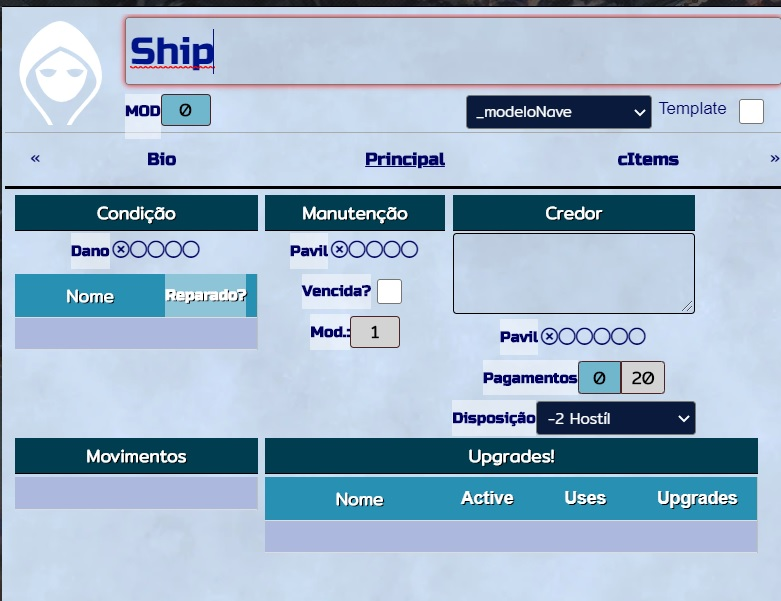
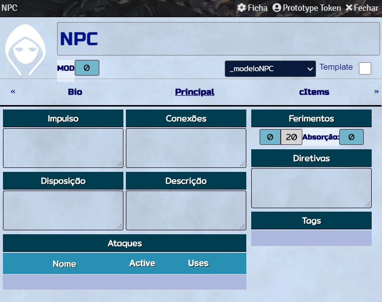
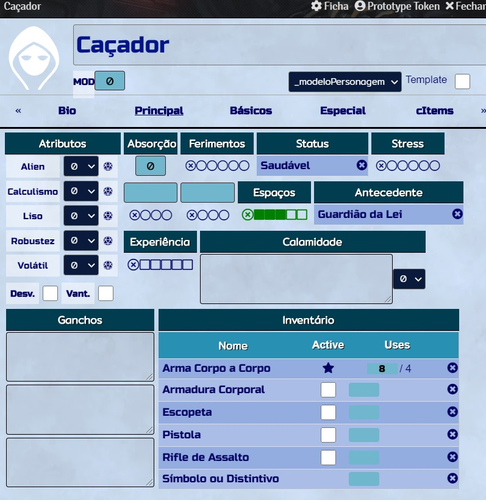
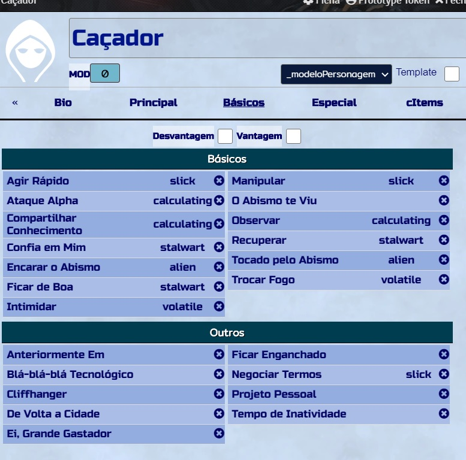
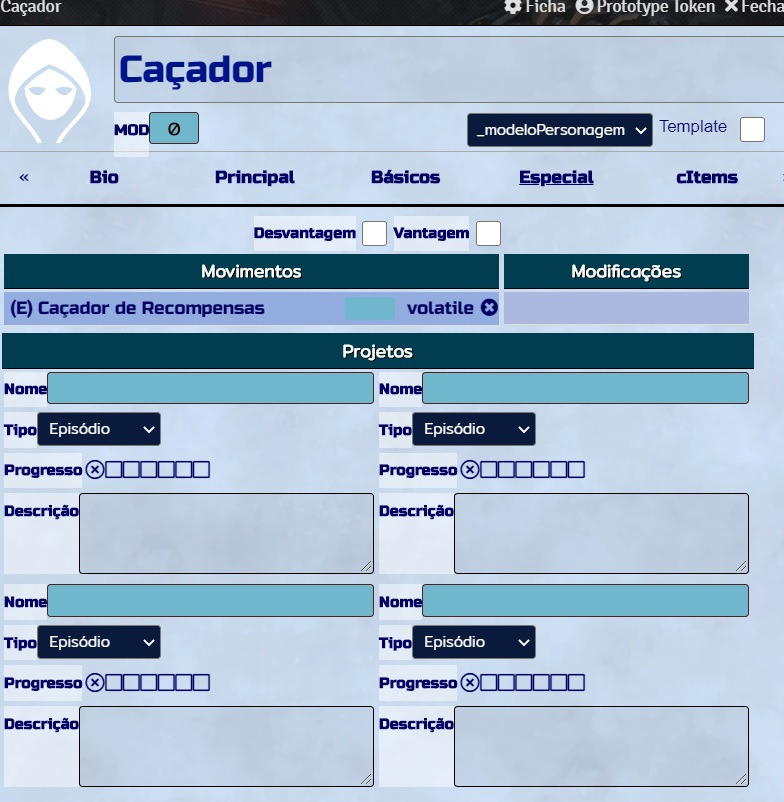
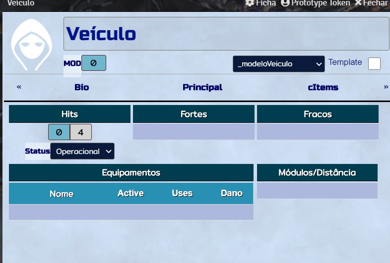
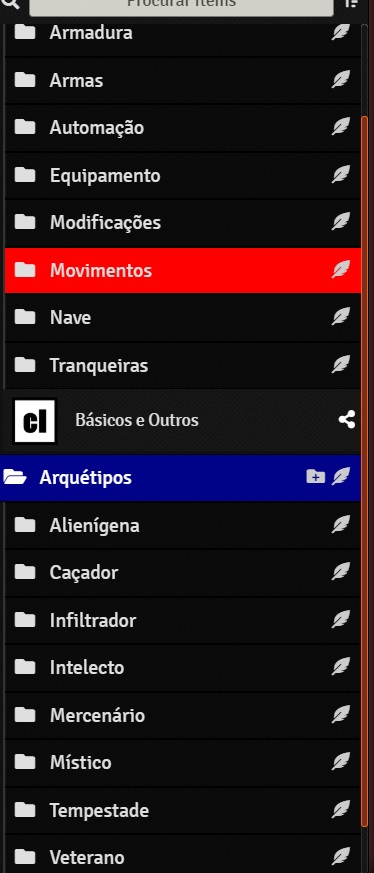
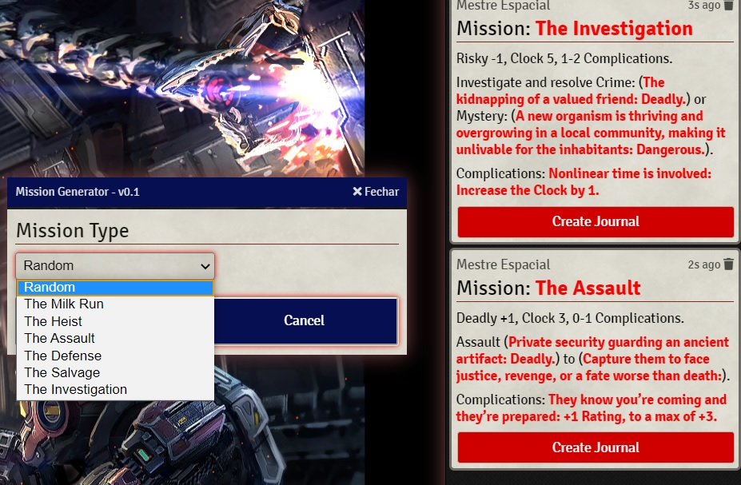

# Impulse Drive
Impulse Drive is a system made by Adrian Thoen. Impulse Drive is a Powered By The Apocalypse hack about making a living on the fringe of civilized space, inspired by Fiction such as Farscape, Firefly, Mass Effect, Star Wars, and many others.

# Where Can I Get the Book?
- With art: https://www.drivethrurpg.com/product/279561/Impulse-Drive
- PWYM: https://www.drivethrurpg.com/product/190933/Impulse-Drive-PWYW

# Impulse Drive for Sandbox
This world uses Sandbox. It was made in Portuguese. But, it's kind easy to back it to english.

# Como Usar
1. Instale o sistema Sandbox
2. Instale o mundo com esse link: https://raw.githubusercontent.com/brunocalado/sandbox_impulsedrive/main/world.json

# Lista de Módulos
chat-images--v2.4.2;
clocks--v1.3.5;
dice-so-nice--v3.3.1;
dice-calculator--v0.6.6;
fxmaster--v1.0.3;
journal-to-canvas-slideshow--v0.1.3;
pdfoundry--v0.8.3;
permission_viewer--v0.8;
playlist_import--v1.6.1;
pt-BR--v1.7.0;
SoundBoard--v1.1.10;
tidy-ui_game-settings--v0.1.21;

# Imagens

# Mudanças
Procure o arquivo [CHANGELOG](CHANGELOG.md) para ver as mudanças.

# License
Impulse Drive by Adrian Thoen and edited by Jim Jacobson is licensed under a Creative Commons Attribution-Share-alike 3.0 Unported License. You can check it out on page 4 from the PDF.
- With art: https://www.drivethrurpg.com/product/279561/Impulse-Drive
- PWYM: https://www.drivethrurpg.com/product/190933/Impulse-Drive-PWYW
 
